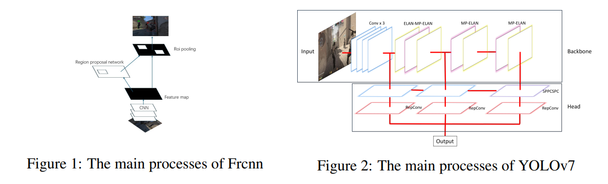

## Team
- YiFan Cai (leader)
- XiHe Yu
- Yu Shi

## Overview
This project investigates the application of real-time object detection in Counter-Strike 2 (CS2). We build a custom in-game dataset and systematically compare multiple detection frameworks to evaluate their accuracy, speed, and practicality in dynamic gaming scenarios. Beyond benchmarking, we demonstrate how detection results can be integrated into gameplay-related applications such as distance estimation and automated aiming.

## Methods
We implement and compare YOLOv7, Faster R-CNN, and SSD.
Key components include:

-Construction of a custom VOC-style CS2 dataset from gameplay footage

-Model training and evaluation under identical settings

-Preprocessing and data augmentation for difficult scenes

-Ensemble-style bounding box fusion using confidence weighting and clustering

## Key Features
-Custom-built CS2 object detection dataset

-Comparative study of one-stage vs. two-stage detectors

-Model ensemble via weighted bounding box averaging

-Real-time in-game deployment with screen capture

-Applications including auto-aiming and target distance estimation

---
<figure style="text-align: center; margin-bottom: 2rem;">
  
  <figcaption style="margin-top: 0.5rem; font-size: 0.9rem; color: #555;">
  </figcaption>
</figure>
<figure style="text-align: center; margin-bottom: 2rem;">
  
  <figcaption style="margin-top: 0.5rem; font-size: 0.9rem; color: #555;">
  </figcaption>
</figure>

