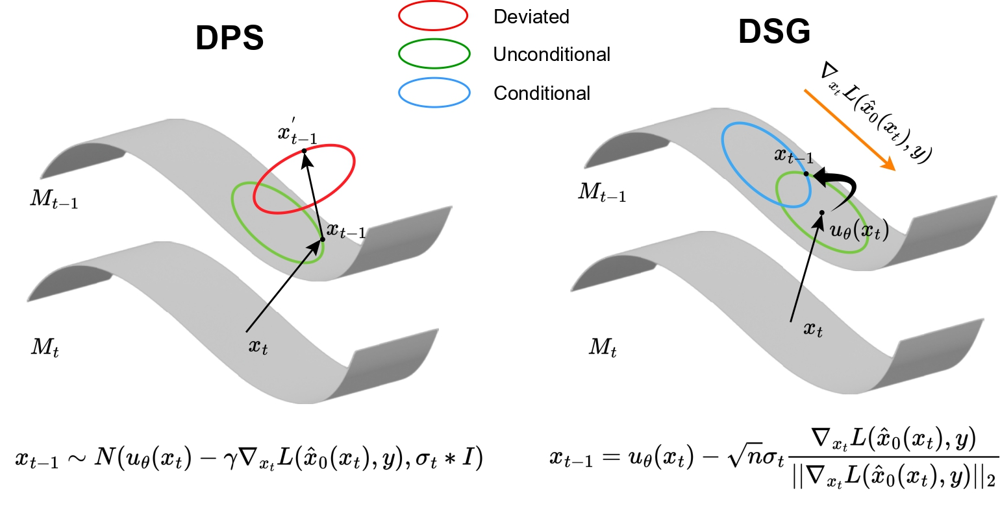

<figure style="text-align: center; margin-bottom: 2rem;">
  
  <figcaption style="margin-top: 0.5rem; font-size: 0.9rem; color: #555;">
  </figcaption>
</figure>

<figure style="text-align: center;">
  
  <figcaption style="margin-top: 0.5rem; font-size: 0.9rem; color: #555;">
  </figcaption>
</figure>
